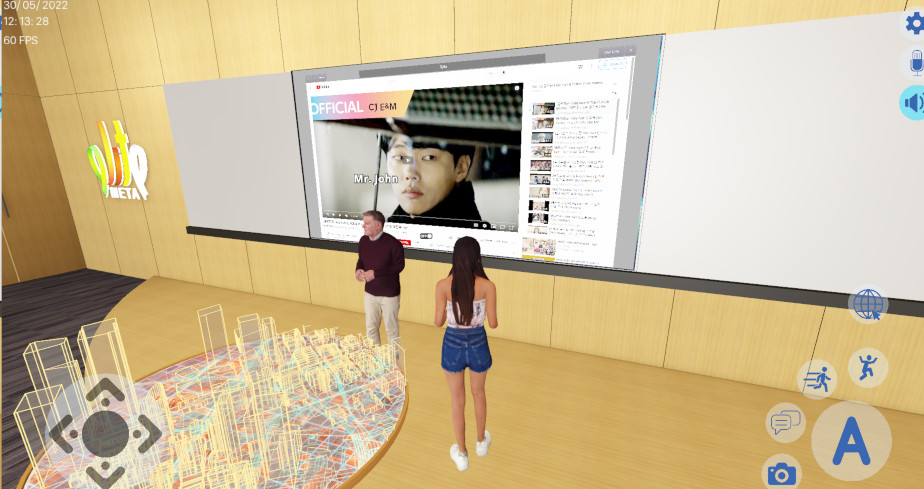

**Announcement: for Linux users for version >= 0.10.0, exporting LD_LIBRARY_PATH or LD_PRELOAD is no longer needed! Do not forget to remove them from your environment (i.e. bashrc)!**

# Chromium Embedded Framework as Godot 4.2 native extension

This repository contains the source code of some C++ classes wrapping a subset
of the [Chromium Embedded Framework](https://bitbucket.org/chromiumembedded/cef/wiki/Home)
API into a Godot 4.2 native extension (GDExtension) which allows you to
implement a web browser for your 2D and 3D games through your gdscripts for
Linux and Windows. We have named this CEF GDExtension module `gdcef`.

This module can be downloaded directly from the Godot asset library:
- https://godotengine.org/asset-library/asset/2508

**Note: You are a Godot-3 dev? You are on the wrong branch. Please go to https://github.com/Lecrapouille/gdcef/tree/godot-3.x instead!**

*Note:* This current repository is a fork of [the following
repo](https://github.com/stigmee/gdnative-cef) (under GPLv3) with a more
permissive license (MIT). Since the original repo is no longer maintained
by their two original authors (Alain and Quentin), we, the undersigned Alain
and Quentin, gave consent to relicensing the original code under the
MIT license.

## Documentation

Since this current README is not taken when importing this module from the Godot asset
library, all details are referred in the following
[document](addons/gdcef/README.md) which explains you how to build
this module, how to run demos, describe the architecture, details design and
more ...

## TL;DR: I do not want to loose time for compiling, I want CEF artifacts right now :)

Check for [releases](https://github.com/Lecrapouille/gdcef/releases). Since tag 0.7.2
CEF artifacts are given for Linux and Windows for x86_64 architectures. Uncompress
the tarball and move the folder inside your project. Rename it as `cef_artifacts`.
The Godot extension is present, you do not have to create one.

## TL;DR: Compilation

To compile this project with the Python3 build script for Linux and Windows:

```
cd addons/gdcef
python3 -m pip install -r requirements.txt
python3 build.py
```

This will generate CEF and Godot artifacts inside a created folder `cef_artifacts/`
at the root of this project. Copy this folder inside your Godot project folder.
The Godot extension is present, you do not have to create one.

## Gallery

If you are using this project, please do not hesitate to share your project links and
pictures by making a GitHub pull request, I'll add them in this gallery. Thanks to
teams for having shared the current gallery:

- https://elitemeta.city

[](https://ipfs.io/ipfs/QmaL7NY5qs3AtAdcX8vFhqaHwJeTMKfP3PbzcHZBLmo1QQ?filename=elitemeta_0.mp4)

*Click to see on the image to see the Elitemeta video shared on IPFS.*
