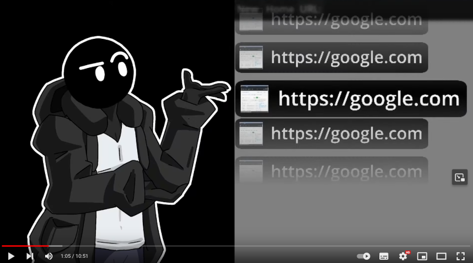
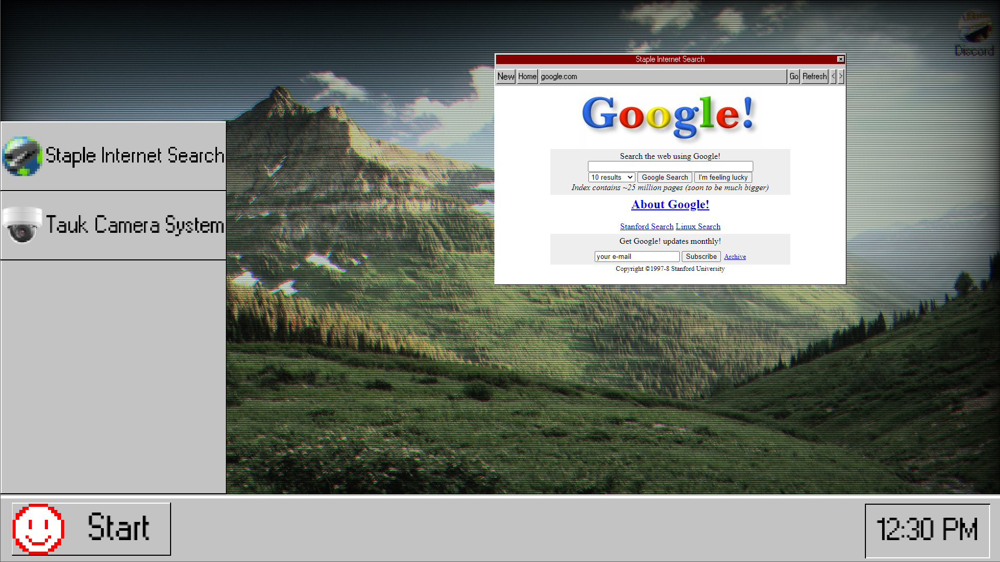

# Chromium Embedded Framework as Godot 4.3 Native Extension

**Note: Are you developing with Godot-3 ? If yes, you are on the wrong branch. Please go to https://github.com/Lecrapouille/gdcef/tree/godot-3.x instead!**

This repository contains C++ classes that wrap a subset of the [Chromium Embedded Framework](https://bitbucket.org/chromiumembedded/cef/wiki/Home) API into a Godot > 4.2 native extension (GDExtension). This allows you to implement a web browser in your 2D and 3D games using GDScript for Linux, Windows and MacOS. The name of this module is `gdcef`.

This module can be downloaded directly either:
- as code source to compile, by git cloning this repository, from this [GitHub repository](https://github.com/Lecrapouille/gdcef).
- as code source to compile, from the [Godot Asset Library](https://godotengine.org/asset-library/asset/2508).
- as precompiled binaries, from the [GitHub releases](https://github.com/Lecrapouille/gdcef/releases).

## Full Documentation

Since this README is not included when importing gdCEF from the [Godot Asset Library](https://godotengine.org/asset-library/asset/2508), all details can be found in the following documents:

- [Installation](addons/gdcef/doc/installation.md)
- [Releases](https://github.com/Lecrapouille/gdcef/releases)
- [API](addons/gdcef/doc/API.md)
- [Details Design](addons/gdcef/doc/detailsdesign.md)
- [Demos](demos/README.md)
- [FAQ](addons/gdcef/README.md#faq)

## TL;DR: Compilation

To compile this project, use the Python3 build script `build.py` for Linux, Windows and MacOS:

```
cd addons/gdcef
python3 -m pip install -r requirements.txt
python3 build.py
```

This will download and compile Godot and CEF, and generate the gdCEF artifacts inside the `cef_artifacts` folder at the root of this project. Copy this folder into your Godot project folder. The GDExtension file is included on this folder, so you don't need to create one.

## TL;DR: I don't want to compile? I want to use gdCEF right now!

Check the [releases](https://github.com/Lecrapouille/gdcef/releases). Since tag 0.7.2, CEF artifacts are provided for Linux and Windows x86_64 architectures. Since tag 0.13.0, MacOS is also supported. Simply uncompress the tarball and move the folder `cef_artifacts` into your project. Do not rename it or remove files inside. The Godot extension file is also included, so you don't need to create one.

## Gallery of projects using gdCEF

If you're using this project, feel free to share your project links and pictures by submitting a GitHub pull request. I'll add them to this gallery. Thanks to the teams who have contributed to the current gallery:

- [Wattesigma](https://github.com/face-hh/wattesigma) by FaceDev

[](https://youtu.be/37ISfJ2NSXQ)

*Click the picture to watch the YouTube video "I made my own Browser" by FaceDev.*

- https://elitemeta.city (discontinued metaverse project)

[](https://ipfs.io/ipfs/QmaL7NY5qs3AtAdcX8vFhqaHwJeTMKfP3PbzcHZBLmo1QQ?filename=elitemeta_0.mp4)

*Click the picture to watch the Elitemeta video shared on IPFS (you need an IPFS client to watch it).*

- [TNITRFR](https://gamejolt.com/games/TNITRFR/948968) with 90's computer browser look.

