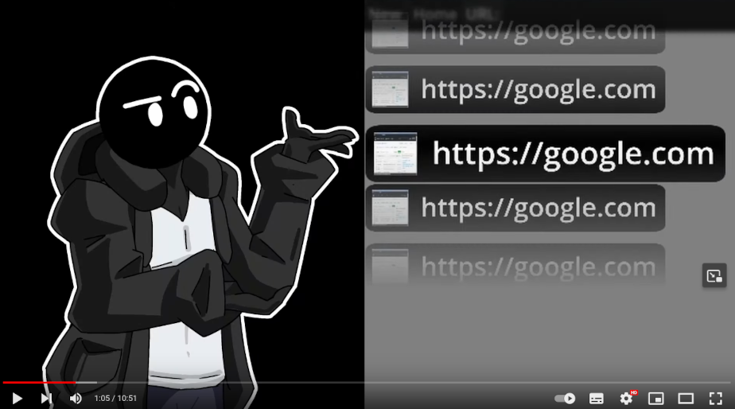
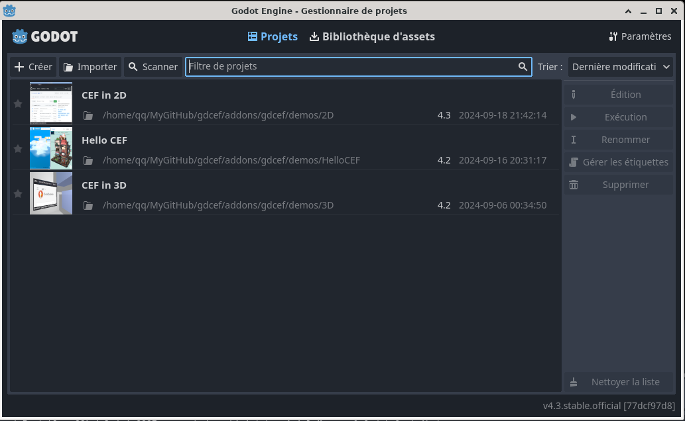

# 🌐 gdCEF - Chromium Embedded Framework for Godot 4

[](LICENSE) [](https://godotengine.org/) [](https://github.com/Lecrapouille/gdcef/releases)

Integrate a fully functional **web browser** into your Godot 4.2+ games for Linux, Windows (and for macOS, we need contributors!). This GDExtension wraps the [Chromium Embedded Framework](https://bitbucket.org/chromiumembedded/cef/wiki/Home) (CEF) API, allowing you to display web content in 2D and 3D scenes using GDScript.

> ⚠️ **Godot 3 users:** Please use the [godot-3.x branch](https://github.com/Lecrapouille/gdcef/tree/godot-3.x) instead.

*🎥 Click the picture to watch the YouTube video "I made my own Browser" by FaceDev!*

[](https://youtu.be/37ISfJ2NSXQ)

---

## 📁 Repository Structure

```
📦gdCEF
 ┣ 📜 build.py              ⬅️ Python3 script for compiling the project
 ┣ 📦 cef_artifacts         ⬅️ Folder with CEF and gdCEF artifacts created by build.py
 ┣ 📂 demos                 ⬅️ Several examples of usage of gdCEF
 ┣ 📂 doc                   ⬅️ Several documents to teach you how to use gdCEF
 ┣ 📂 gdcef                 ⬅️ C++ code source of the gdextension (to be compiled)
 ┃ ┣ 📂 browser             ⬅️ Code for the CEF main process (libgdcef used by CEF)
 ┃ ┣ 📂 subprocess          ⬅️ Code for the CEF secondary process (gdCefRenderProcess used by libgdcef)
 ┃ ┣ 📂 patches             ⬅️ Patch files to apply to the CEF source code
 ┃ ┗ 📂 tests               ⬅️ Unit tests
 ┗ 📂 thirdparty            ⬅️ Downloaded packages by build.py
   ┣ 📂 cef_binary          ⬅️ CEF distribution used to build dependencies (downloaded)
   ┗ 📂 godot-cpp           ⬅️ Godot C++ API and bindings (downloaded)
```

---

## ⚡ Quick Start

### 🛠️ Option 1: Compile from Source

```bash
python3 -m pip install -r requirements.txt
python3 build.py
```

The `cef_artifacts` folder will be created at the project root with all necessary files.

Depending on your computer but count around 15 min to compile:

- download and compile godot-cpp.
- download and compile CEF.
- compile gdCEF.

### 📦 Option 2: Download Prebuilt Binaries from GitHub

1. ⬇️ Download the latest release from [GitHub Releases](https://github.com/Lecrapouille/gdcef/releases).
2. 📁 Extract and copy the `cef_artifacts` folder into your Godot project.
3. ✅ Done! The `.gdextension` file is already included in the folder.

### 🎮 Option 3: Download Prebuilt Binaries from Godot Asset Lib

1. 🏛️ Open the Godot editor, and click the "AssetLib" button.
2. 🔎 In the search bar, type `gdcef`.
3. 📁 Download the `cef_artifacts` folder into your Godot project. Be sure to have clicked on "Ignore asset root".
4. ⚠️ Godot does not preserve file attributes. Call `cd cef_artifacts/linux/ && chmod +x *.so gdCefRenderProcess` to restore them.
5. ✅ Done! The `.gdextension` file is already included in the folder.

---

## 📝 Hello gdCEF World!

1. Create a gdCEF node in your scene graph.
2. Create a TextureRect in your scene graph.
3. Create a gdscript with the following basic content:

```gdscript
extends GDCEF

func _ready():
    $CEF.initialize({})
    var browser = $CEF.create_browser("https://godotengine.org", $TextureRect, {})
```

> ⚠️ This minimal example needs more code to have a usable browser in your game. See the [Getting Started Guide](doc/getting-started.md) for detailed instructions.

---

## 📚 Documentation

| Document | Description |
|-------------|---------------|
| [Getting Started](doc/getting-started.md) | 🚀 How to integrate gdCEF in your project |
| [API Reference](doc/API.md) | 📑 Complete GDScript API documentation |
| [Installation](doc/installation.md) | 🔧 Detailed compilation instructions |
| [FAQ](doc/faq.md) | ❓ Common questions and troubleshooting |
| [Architecture](doc/architecture.md) | 🏗️ How CEF works internally |
| [Design Details](doc/detailsdesign.md) | 🗂️ Repository organization and build system |
| [Gallery](doc/gallery.md) | 🖼️ Gallery of projects using gdCEF |

---

## 🎲 Demos

Ready-to-use demos are included in the [demos/](demos/) folder:



| Demo                             | Description                                        |
|--------------------------------------|------------------------------------------------------|
| **[Hello CEF](demos/HelloCEF/)**     | 👋 Minimal example to start with                                  |
| **[2D Demo](demos/2D/)**             | 🌟 Full-featured browser with tabs, showcasing most of the API |
| **[3D Demo](demos/3D/)**             | 🌀 Browser in a 3D scene with spatial audio           |
| **[JS Bindings](demos/JS/)**         | 🔗 JavaScript to GDScript communication              |

---

## 🏆 Alternatives

| Project | Description |
|-----------------------------------|-------------------------------------------------------------|
| [godot_wry](https://github.com/doceazedo/godot_wry) | 🦀 WebView in Rust |
| [GodotWebView](https://godotwebview.com/) | 🧩 Qt-based solution |
| [GodotChrome](https://github.com/Sam2much96/GodotChrome) | 🤖 Android/Godot 3 |

---

## ⚖️ License

This project is licensed under the [MIT License](LICENSE).

> ⚠️ **Note:** CEF uses LGPL third-party libraries. See the [FAQ](doc/faq.md#licensing) for licensing implications.
