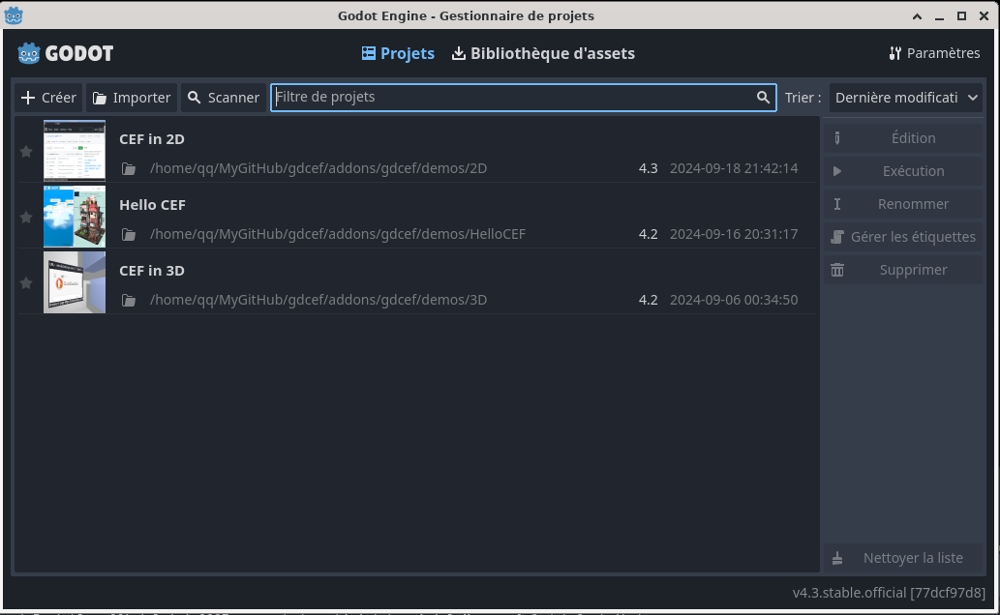
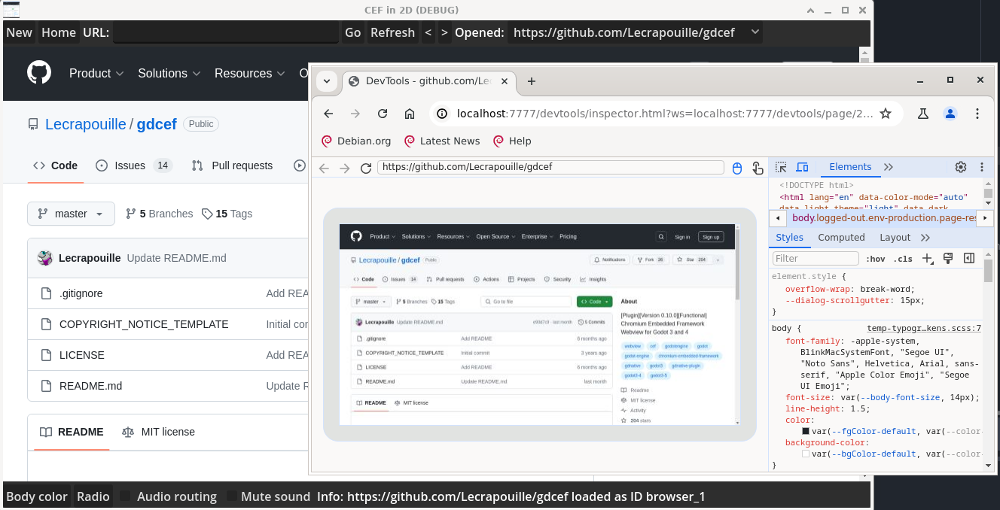
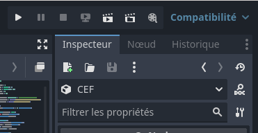

# Chromium Embedded Framework as Godot 4.3 Native Module

This repository provides C++ classes that wrap part of the [Chromium Embedded Framework](https://bitbucket.org/chromiumembedded/cef/wiki/Home) (CEF) API into a Godot 4.2+ native module (GDExtension). This enables web browser integration into your Godot 2D and 3D games for Linux, Windows and macOS. The name of this module is `gdcef`.

## TLDR: Compilation Steps

A complete guide for compiling this project using the Python3 build script is available [here](doc/installation.md). It also explains how to update the CEF version. For those in a hurry, simply follow these steps:

```
cd addons/gdcef
python3 build.py
```

If successful, a build folder named `cef_artifacts` will be created at the root of the project. This folder contains all CEF/Godot artifacts needed for your Godot project. You don't need to manually add `.gdextension` files referencing `libgdcef.so` (or `libgdcef.dll` or `libgdcef.dylib` depending on your OS) as they are automatically included.

## Running demos

After successfully compiling the project, launch Godot Editor 4 and navigate to the [demos folder](demos) where you'll find ready-to-use 2D and 3D demos. For more information about these demos, please refer to their dedicated [README](demos/README.md).



## Repository overview

This repository contains the following important elements:
- C++ code source for the [primary CEF process](gdcef/): your Godot application.
- C++ code source for the [secondary CEF process](subprocess/), called by the first CEF process.
- Some demos in [2D](demos/2D/) and [3D](demos/3D/). The 2D demo shows almost all the API.
- A python-3 [build script](build.py) that will git clone the Godot-cpp binding, download the CEF tarball, extract it, compile CEF, compile the primary and secondary CEF process, and finally create the CEF artifacts in the `cef_artifcats` folder.

*Note:* While we are using C++20, we aren't utilizing advanced features, but we require this version for the `filesystem` library. And with C++17, the `filesystem` library seems not working correctly with Windows.

## Documentation

We've included documentation to help you understand the core aspects of this project:
- The Godot GDScript API is documented [here](doc/API.md). This document describes all the functions that can be called from your GDScripts.
- The design details are explained in this [document](doc/detailsdesign.md). It explains the repository organization, how gdcef is compiled, why a secondary process is needed, and more.
- The software architecture is detailed in this [document](doc/architecture.md). This document explains how CEF works internally. **Note: this document is a draft**.

## FAQ

### Why I need to compile prebuilt CEF whereas .dll and other stuffs are already given ?

Because we need to link against `libcef_dll_wrapper` that is only obtained by compiling CEF sources.

### How do I use CEF in my personal project?

- Copy the `cef_artifacts` folder containing the compiled CEF artifacts into your Godot project.
- Delete the `cef_artifacts/cache` folder if you have previously used gdCEF.
- If you want to use a different name for the CEF artifacts folder, you can change it in the [build.py](../build.py) script. Find the line `CEF_ARTIFACTS_FOLDER_NAME = "cef_artifacts"`, modify it and rerun `build.py`. This will update the path in Godot.
  Alternatively, you can specify it explicitly when calling `initialize({"artifacts": "res://cef_artifacts/", ... })`.
- CEF can run directly from the Godot editor, and you can export your project for Linux and Windows as usual.
- The gdcef module verifies the presence of both CEF artifacts and the secondary CEF process. If either is missing, your application will close.
- From the node selector, add a Godot `TextureRect` to your scene graph to hold your browser's texture. Name it `TextureRect`.
- From the node selector, look for the `GDCEF` node and name it `CEF`. If not found, this means the GDExtension file hasn't been loaded.
- Create a GDScript. Use `initialize` to start CEF, instead of the usual Godot `_init` method. Refer to this [document](doc/API.md) for details on the available functions. For example, inside `func _ready():` of the `$CEF` node, create a new browser with the `create_browser` function, passing the desired URL, the `TextureRect` and optional settings (default: `{}` - see the API for possible options). The browser you create will be a child node in Godot, with a default name of `browser_<id>` (where `<id>` starts at 0). You can rename it using the `set_name()` function. Like any Godot node, the browser can be found with a function such as `$CEF.get_node("browser_0")`.

```
var browser = $CEF.create_browser("https://github.com/Lecrapouille/gdcef", $TextureRect, {})
browser.set_name("hello")
```

- You will get a basic CEF browser that does not respond to mouse or keyboard inputs. Check the 2D and 3D demos to learn how to make your browser respond to input events.
- Here are some projects that might inspire you:
  - https://github.com/face-hh/wattesigma

## How to debug gdCEF?

In your GDScript, when initializing CEF, pass the following settings:

```
$CEF.initialize({"remote_debugging_port": 7777, "remote_allow_origin": "*", ... })
```

Open a Chrome browser and type in the URL: `chrome://inspect`. A documents appears. Click on the `Configure` button of `Discover network targets`. Set `localhost:7777` as the port. You will see something like this:



### Why is my CPU usage at 70% when running gdCEF?

Try switching Godot's graphics mode to 'Compatibility' instead of 'Forward+'. See below, on the top right corner:



### Important note about certain architectures!

- CEF is currently not supported on iOS or Android devices. For Android, you can see this [project](https://github.com/Sam2much96/GodotChrome).
- Chrome extensions are limited to version 2, although most users now rely on version 3.

### I have limitations!

Yes, we know:
- Keyboard limitation: https://github.com/Lecrapouille/gdcef/issues/55.
- Slow and with limitations: https://github.com/Lecrapouille/gdcef/issues/50.
- Restrcited for some access: https://github.com/Lecrapouille/gdcef/issues/75.

### I cannot watch videos!

CEF does not include by default H264 or ffmpeg codecs for licensing reasons. You can add them by compiling CEF by yourself with the correct options, instead of using the prebuilt binaries. I'm sorry but gdCEF, currently, follows restrictions imposed by CEF.

### How to block ads?

For the moment we cannot block ads.

### Why your classes uses subclass Impl?

Godot uses a reference counter that conflicts with CEF's reference counter. To avoid compilation issues, we have to trick by creating an intermediate class.

### Important notes on the CEF license!

**IMPORTANT:** I'm not a legal expert, but be aware that CEF uses some third-party libraries under the LGPL license (see this [post](https://www.magpcss.org/ceforum/viewtopic.php?f=6&t=11182)). Compiling CEF as a static library may subject **your** project to the GPL license, requiring you to share your application's source code. This does not apply when compiling CEF as a dynamic library.

In our case, CEF is compiled as a static library for Windows (due to various issues, see our [patch](patches/CEF/win/)), and as a shared library (`libcef.so` > 1 GB, which is quite large) for Linux. Unfortunately, I was unable to compile it as a static library on Linux to reduce its size.

### Note concerning gdCEF license

This repository is a fork of [this repo](https://github.com/stigmee/gdnative-cef), originally under GPLv3, but with a more permissive license: MIT. Since the original repo is no longer maintained by its two original authors (Alain and Quentin), we, the undersigned Alain and Quentin, have given consent to relicense the original code under the MIT license.