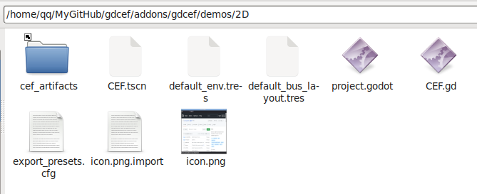
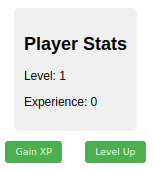

# Godot/CEF Demos

## Compile demos

You can run demos directly if you have already compiled gdCEF (`cd .. && /build.py`). Otherwise, you can add the folder `cef_artifacts` and its content from [GitHub releases](https://github.com/Lecrapouille/gdcef/releases) in each demo folder. No extra command line is needed.

**Note**: CEF artifacts are loaded from the `cef_artifacts` folder at the same level of your application made in Godot. Because we have several demos and CEF artifacts are heavy (libcef.so is > 1 GB), to avoid consuming GB of disk space with duplicated files, we made for each demo folders an alias to the real `cef_artifacts` folder, created during the build process and located at the root of the gdcef project. For your personal project, it's better not to use an alias and have all CEF artifacts inside a real folder `cef_artifacts` at the root of your Godot project.

## Run demos

Just open your Godot editor 4.2+ and search for the `project.godot` file of the desired demo. Open the demo and run it directly inside the Godot editor.

## Understanding the architecture

Please refer to the [architecture](../doc/architecture.md) documentation for more details.
### Demo 00: Hello CEF

A "Hello-world" demo showing a 2D GUI split vertically into two browsers. Only the left browser accepts mouse and keyboard events. The right browser does not allow interaction since a timer is used for loading different URLs one by one. No keyboard events and mouse events are sent to the browser.

### Demo 01: CEF browser in 2D

Basic browser with multiple tabs to show almost all API features.

Type inside the URL entry your desired URL then click on the `Go` button. Once the URL is correct and the page is loaded, the URL is saved in your current browser tab. To create a new browser tab, click on the `+` button: a default local page is displayed (showing how to load a local HTML file). If the URL is incorrect, the page is not loaded and error message is displayed. When downloading files, the browser will save them in the `Downloads` folder defined in the CEF settings (passed to the browser via the `settings` argument of `GDCef.create_browser`). A basic progressbar is displayed.The 'color' button shows a basic builtin JavaScript injection: it changes the background color (this function is basic since you cannot get result from JavaScript). Buttons allow to route the sound to Godot and apply some filters.

### Demo 02: CEF browser in 3D

A demo showing a 3D GUI with a single CEF browser tab showing a radio website. The tab is rotating inside a 3D scene. The sound is routed to Godot for applying 3D sound effects. You can surf to the web while the purpose of this demo is to show how to use CEF in a 3D environment.

This demo is based on the asset library: https://godotengine.org/asset-library/asset/127

### Demo 03: CEF browser in 2D with JS bindings

A demo showing a 2D GUI made in HTML/CSS/JavaScript and loaded in a CEF browser. The demo shows how to bind Godot methods to JavaScript functions using JS Binder.

