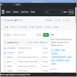

# Godot/CEF Demos

## Compile demos

If all prerequisites have been installed (Python 3, Godot 3.4+, CMake > 3.19, g++, VS2022)
and you have either Linux or Windows. Just type:

```
cd ..
./build.py
```

No command line is needed. This script will:
- Download and compile CEF
- Download and compile Godot-cpp
- Create the CEF artifcats needed for running demos (inside `build` at the root of the project).

**Workaround For Windows:** You need **x64 Native Tools Command Prompt for VS 2022**, with
  **Administrator** privilege!

**Note concerning the build folder**:

CEF artifcats are searched inside the `build` folder at the root of your Godot project.
Because we have several demos and CEF artifacts are heavy (libcef.so is > 1 GB), to avoid
consuming GB of disk space of duplicated files, we have stored artifacts at `examples/build`
and make demos have an alias on this folder. For your personal project, it's better not
using alias and have all CEF artifacts in a real folder `build` at the root of your Godot
project.

## Run demos

Just open you Godot editor 3.4+ and search the `project.godot`. Open the demo and run it
directly (no prerequesites).

## Demos

## Demo 00: Hello CEF

A "Hello-world" demo showing a 2D GUI split vertically in two browsers. Only the left browser
accept mouse and keyboard events. The right browser does not allow interaction since a timer
is used for loading different URLs one by one.


## Demo 01: CEF browser in 2D

Basic browser with multiple tabs to show all API features.

Type inside the URL entry your desired URL. It loads dynamicaly the URL. While the URL is not
complete the page is not yet loaded. Once the URL is correct and the page loaded, the URL is saved
in your current browser tab. To create a new browser tab, click on the `+` button: a default page
is displayed, then type in the URL to load a new web page.

The 'color' button shows a basic Javascript injection: it changes the background color.



## Demo 02: CEF browser in 3D

A demo showing a 3D GUI with a single CEF browser tab. The tab is rotating inside a 3D scene.
You can use your mouse and keyboard to surf on the web :)

This demo is based on the asset library: https://godotengine.org/asset-library/asset/127


