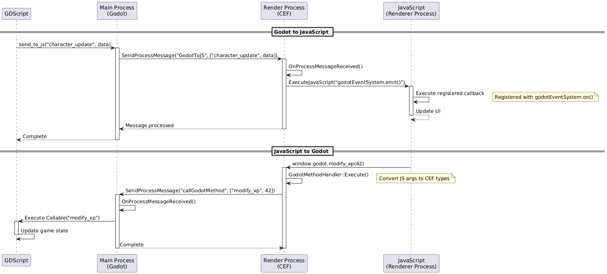

# Software Architecture

This document details the software architecture of [gdCEF](https://github.com/Lecrapouille/gdcef), a GDExtension for the [Godot engine](https://godotengine.org/) that implements [Chromium Embedded Framework](https://bitbucket.org/chromiumembedded/cef/wiki/Home) webviews.

## Overview

The gdCEF consists of two main processes:

1. A main process that handles CEF initialization and browser management
2. A render process that handles web page rendering and JavaScript execution

## Core Components

### Main Process Classes

Two main classes are exposed to Godot as Nodes:

- **GDCef**: The entry point class that:
  - Initializes CEF and manages its lifecycle.
  - Handles CEF settings and configuration.
  - Creates and manages browser instances.
  - Routes messages between CEF subprocesses.
  - Shall be considered as a singleton.

- **GDBrowserView**: Represents a browser view instance that:
  - Manages web page display and rendering.
  - Handles user interactions (mouse, keyboard).
  - Controls page navigation and JavaScript execution.
  - Manages audio streaming.
  - Handles file downloads.

These classes are derived from `godot::Node`, allowing them to be integrated into Godot's scene tree:


`GDBrowserView` shall not directly be created by the user, but by the `GDCef` class through the `create_browser_view()` method. They are automatically added to the scene tree when created as a child of a `GDCef` node. They are automatically removed from the scene tree when destroyed or when closed. They are not shown in the Godot scene tree by design by Godot.

In the above picture, the `Control` node is a 2D Control node used for the layout of the browser view. A `TextureRect` node is used to display the web page.

```gdscript
var settings = {...}
var browser = $CEF.create_browser("https://www.google.com", $TextureRect, settings)
```

### Render Process

The render process is implemented in a separate executable and handles:

- Web page rendering.
- JavaScript execution.
- V8 context management.
- Communication with the main process.

It is mandatory to for offscreen rendering (avoiding native window creation). The drawback is the loose of GPU compositing.

## Communication Flow

### Initialization Sequence


1. GDScript initializes GDCef with configuration.
2. CEF initializes and forks required processes.
3. The render process starts and initializes its components.
4. Browser instances can then be created.

### Rendering Sequence


1. The render process renders web content.
2. Content is painted to an off-screen buffer.
3. The buffer is converted to a Godot texture.
4. The texture is displayed in the Godot scene.

### Download Sequence


1. Download is initiated from browser.
2. CEF handles the download process.
3. Progress updates are sent to Godot.
4. Download completion is signaled.

### JavaScript/Godot Communication

The module implements bidirectional communication between JavaScript and Godot through an IPC (Inter-Process Communication) system:



#### Godot to JavaScript

When Godot needs to send data to JavaScript:
1. GDScript calls `send_to_js(event_name, data)`.
2. The Main Process sends an IPC message to the Render Process.
3. The Render Process executes JavaScript code that emits an event.
4. JavaScript callbacks registered with `godotEventSystem.on()` receive the data.

#### JavaScript to Godot

When JavaScript needs to call Godot methods:
1. JavaScript calls methods through the `window.godot` proxy.
2. The Render Process converts JavaScript arguments to CEF types.
3. An IPC message is sent to the Main Process.
4. The Main Process executes the corresponding GDScript callable.

### Event System

The module injects a JavaScript event system into web pages:
- `window.godotEventSystem.on(event_name, callback)`: Register event listeners.
- `window.godot.methodName()`: Call Godot methods directly.

Example usage:

## Class Relationships

The following diagram shows the relationships between the main components:


### Key Relationships

- GDCef creates and manages GDBrowserView instances.
- GDBrowserView communicates with CEF browser instances.
- The render process communicates with both GDCef and browser instances.
- All CEF-related classes implement appropriate CEF interfaces.

## Implementation Details

- The module uses CEF's windowless rendering mode for seamless integration with Godot.
- Audio is routed through Godot's audio system.
- JavaScript integration allows bidirectional communication between Godot and web content.
- File downloads are managed through CEF's download handler interface.
- Mouse and keyboard events are translated from Godot to CEF format.

## Technical Constraints

- CEF requires a separate render process executable.
- The render process path must be canonical.
- CEF modifies command line arguments during initialization.
- Memory management must account for both Godot's reference counting and CEF's reference counting.

For API documentation and usage examples, please refer to [API.md](API.md).