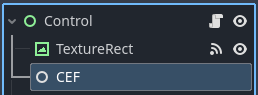

# Software Architecture

This document details the software architecture of [gdcef](https://github.com/Lecrapouille/gdcef), a native module for the [Godot engine](https://godotengine.org/) that implements the [Chromium Embedded Framework](https://bitbucket.org/chromiumembedded/cef/wiki/Home) (CEF).

## Overview

The gdcef module consists of two main components:

1. A main process that handles CEF initialization and browser management
2. A render process that handles web page rendering and JavaScript execution

## Core Components

### Main Process Classes

Two main classes are exposed to Godot as Nodes:

#### GDCef Class

Implemented in `gdcef/src/gdcef.hpp`, this class serves as the entry point:

- **GDCef**: The entry point class that:
  - Initializes CEF and manages its lifecycle
  - Handles CEF settings and configuration
  - Creates and manages browser instances
  - Routes messages between CEF subprocesses

- **GDBrowserView**: Represents a browser instance that:
  - Manages web page display and rendering
  - Handles user interactions (mouse, keyboard)
  - Controls page navigation and JavaScript execution
  - Manages audio streaming
  - Handles file downloads

These classes are derived from `godot::Node`, allowing them to be integrated into Godot's scene tree:

### Render Process

The render process is implemented in a separate executable and handles:

- Web page rendering
- JavaScript execution
- V8 context management
- Communication with the main process

## Communication Flow

### Initialization Sequence

1. GDScript initializes GDCef with configuration
2. CEF initializes and forks required processes
3. The render process starts and initializes its components
4. Browser instances can then be created

### Rendering Sequence

1. The render process renders web content
2. Content is painted to an off-screen buffer
3. The buffer is converted to a Godot texture
4. The texture is displayed in the Godot scene

### Download Sequence

1. Download is initiated from browser
2. CEF handles the download process
3. Progress updates are sent to Godot
4. Download completion is signaled

## Class Relationships

The following diagram shows the relationships between the main components:

### Key Relationships

- GDCef creates and manages GDBrowserView instances
- GDBrowserView communicates with CEF browser instances
- The render process communicates with both GDCef and browser instances
- All CEF-related classes implement appropriate CEF interfaces

## Implementation Details

- The module uses CEF's windowless rendering mode for seamless integration with Godot
- Audio is routed through Godot's audio system
- JavaScript integration allows bidirectional communication between Godot and web content
- File downloads are managed through CEF's download handler interface
- Mouse and keyboard events are translated from Godot to CEF format

## Technical Constraints

- CEF requires a separate render process executable
- The render process path must be canonical
- CEF modifies command line arguments during initialization
- Memory management must account for both Godot's reference counting and CEF's reference counting

For API documentation and usage examples, please refer to [API.md](API.md).

