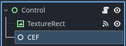

# Details Design: How is gdCEF compiled?

This document explains how the `gdCEF` module is organized and compiled. The detailed design of the internal workings is described in another [document](addons/gdcef/doc/detailsdesign.md) (currently unfinished). For implementation details, you will need to dive directly into the CEF source code, which contains extensive comments that may be challenging to understand at first.

*Note:* This document was initially written for a parent project using gdCEF and Godot 3. Some legacy parts may remain that have not been fully updated.

## Tree structure of the gdCEF project

The tree structure of the gdCEF project may differ slightly from what is shown here, depending on its evolution. The general organization follows this pattern:

```
📦gdCEF
 ┣ 📂gdcef                 ⬅️ Code for the CEF main process (git cloned)
 ┣ 📂render_process        ⬅️ Code for the CEF secondary process (cloned)
 ┣ 📂thirdparty
 ┃ ┣ 📂cef_binary          ⬅️ CEF distribution used to build dependencies (downloaded)
 ┃ ┗ 📂godot-cpp           ⬅️ Godot C++ API and bindings (downloaded)
 ┗ 📂patches               ⬅️ Patch files to apply to the CEF source code
```

## The Godot C++ binding API (📂godot-cpp)

The first component, not included in the gdCEF repository, is the `godot-cpp` folder. It must be present before attempting any compilation of a Godot module. This folder comes from this [repository](https://github.com/godotengine/godot-cpp) and provides bindings to the Godot API that allow you to compile your code as a Godot module, similar to compiling directly within the Godot editor's source code (see [here](https://docs.godotengine.org/en/stable/development/cpp/custom_modules_in_cpp.html) for more information).

*Note:* Unlike compiling your module directly inside the Godot engine's `modules` folder, this method has a drawback: each exported function call goes through additional intermediate functions imposed by the binding layer. In our case, this is acceptable since CEF rarely triggers the Godot engine. Additionally, method names may differ slightly from the official API. One advantage for this project is the presence of C++ namespaces, which resolves name conflicts with error enumerators (Godot and CEF use the same error names). Finally, implementing CEF natively inside the Godot engine would require direct modifications to the Godot source code, which is more complex than using C++ bindings. If you're curious and read French, you can check this [document](https://github.com/stigmee/doc-internal/blob/master/doc/tuto_modif_godot_fr.md#compilation-du-module-godot-v34-stable) detailing how we achieved this.

The `godot-cpp` repository should be cloned **recursively** using the appropriate branch: `git clone --recursive -b 4.3 https://github.com/godotengine/godot-cpp`. Recursive cloning will include the appropriate godot-headers used to generate the C++ bindings and will produce this kind of message (useless information have been removed for the clarity of this document):

```
Cloning into 'godot-cpp'...
...
Submodule 'godot-headers' (https://github.com/godotengine/godot-headers) registered for path 'godot-headers'
Cloning into '<Project>\godot-native\godot-cpp/godot-headers'...
...
Submodule path 'godot-headers': checked out 'd1596b939d6c9f5df86655ea617713ef321ad938'
```

The `godot-cpp` folder is automatically downloaded and compiled by the install script `build.py` which calls a command similar to these lines:

```
cd godot-cpp
scons platform=windows target=release
```

Where [scons](https://scons.org/) is a build system like Makefile but using the Python interpreter and used by Godot team to compile the Godot engine and its modules.

## Prebuilt Chromium Embedded Framework (📂cef_binary)

The second component, not present in the repository when cloned, `cef_binary` contains the CEF with prebuilt libraries with the C++ API and some code to compile. These libraries are needed to make the gdCEF module compilable and artifacts needed to make the module runnable once launched. Artifacts are created when this component is compiled.

Note that building CEF source code 'from scratch' is too complex: too long (around 4 hours with a good Ethernet connection, at worst 1 day with poor Ethernet connection), too huge (more than 100 GB of your disk) and your system shall install plenty of system packages (apt-get). That is why we use prebuilt libraries from the CEF website https://cef-builds.spotifycdn.com/index.html.

Since this folder `cef_binary` cannot be directly included in gdCEF repository, it is downloaded, unpacked in an automatic way by the `build.py` script. This script understands your operating system and the desired CEF version: an inspection inside the CEF's README (if present) allows to know if CEF has been previously downloaded or if the version is matching (if not, this means we wanted to install a different CEF version: the old `cef_binary` folder is removed and the new one is downloaded, unpacked and compiled automatically).

To compile CEF, our build script `build.py` will call something similar to the following lines (but depending on your operating system):

```
cd ./thirdparty/cef_binary
cmake -DCMAKE_BUILD_TYPE=Release .
cmake --build . --config Release
```

The following libraries and artifacts must be copied to the Godot project root `res://`, otherwise Godot will not be able to locate them and will fail to load the module dependencies at project startup. These files are placed in the `cef_artifcats` folder (which needs to be created). For Windows, these files are mandatory for CEF to start correctly. The `build.py` script handles this automatically for all operating systems.

For Windows, current builds use dynamic libraries, while the default VS solution is configured for static compilation. Therefore, you (or the build script) need to use VS to compile in Release mode and change the compiler settings from `/MT` to `/MD`, as well as add these two preprocessor flags:

* `_ITERATOR_DEBUG_LEVEL = 0;`                 under `C/C++ >> Preprocessor >> PreprocessorDefinitions`.
* `_ALLOW_ITERATOR_DEBUG_LEVEL_MISMATCH`       under `C/C++ >> Preprocessor >> PreprocessorDefinitions`.

Our build script `build.py` applies a patch before compilation. On Linux, static compilation appears to be impossible, resulting in a much larger `libcef.so` - over 1 gigabyte, which is significantly larger than the Windows version (likely because Windows better understands which symbols to export).

*IMPORTANT:* Since CEF uses some third-party libraries under the LGPL license, compiling them as static libraries would force the project under the GPL license (this is not the case when compiled as dynamic libraries). See this [post](https://www.magpcss.org/ceforum/viewtopic.php?f=6&t=11182). In our case, this is not an issue since our project is already under the GPL license.

## CEF artifacts compiled from CEF source code (📂cef_artifacts)

The `cef_artifacts` folder contains the following files (which may vary depending on your operating system and CEF version). The folder name is defined in the `build.py` script.

```
📦gdCEF
 ┣ 📂...                            ⬅️ Other folders seen in previous sections
 ┗ 📂cef_artifacts                  ⬅️ Name defined in build.py script
    ┣ 📂locales                     ⬅️ Locale-specific resources and strings
    ┃ ┣ 📜en-US.pak                 ⬅️ English
    ┃ ┗ 📜*.pak                     ⬅️ Other languages
    ┣ 📜chrome_elf.dll              ⬅️ Crash reporting library
    ┣ 📜d3dcompiler_47.dll          ⬅️ Or Vulkan for other OS
    ┣ 📜libEGL.dll                  ⬅️ Accelerated compositing support libraries
    ┣ 📜libGLESv2.dll               ⬅️ Accelerated compositing support libraries
    ┣ 📜libcef.dll                  ⬅️ CEF core library
    ┣ 📜snapshot_blob.bin           ⬅️ JavaScript V8 initial snapshot
    ┣ 📜v8_context_snapshot.bin     ⬅️ JavaScript V8 initial snapshot
    ┣ 📜icudtl.dat                  ⬅️ Unicode support data
    ┣ 📜chrome_100_percent.pak      ⬅️ Non-localized resources and strings
    ┣ 📜chrome_200_percent.pak      ⬅️ Non-localized resources and strings
    ┗ 📜resources.pak               ⬅️ Non-localized resources and strings
```

The following components are required - CEF will not function without them:

* CEF core library
  * libcef.dll

* Crash reporting library
  * chrome_elf.dll

* Unicode support data
  * icudtl.dat

* V8 snapshot data
  * snapshot_blob.bin
  * v8_context_snapshot.bin

The following components are optional. If missing, CEF will continue to run, but related functionality may be broken or disabled:

* Localized resources: Locale file loading can be disabled completely using CefSettings.pack_loading_disabled. The locales directory path can be customized using CefSettings.locales_dir_path.

  * locales/ Directory containing localized resources used by CEF, Chromium and Blink. A .pak file is loaded from this directory based on the CefSettings.locale value. Only configured locales need to be distributed. If no locale is configured the default locale of "en-US" will be used. Without these files arbitrary Web components may display incorrectly.

* Other resources. Pack file loading can be disabled completely using CefSettings.pack_loading_disabled. The resources directory path can be customized using CefSettings.resources_dir_path.

  * cef.pak
  * cef_100_percent.pak
  * cef_200_percent.pak
    These files contain non-localized resources used by CEF, Chromium and Blink.
    Without these files arbitrary Web components may display incorrectly.

  * cef_extensions.pak
    This file contains non-localized resources required for extension loading.
    Pass the `--disable-extensions` command-line flag to disable use of this
    file. Without this file components that depend on the extension system,
    such as the PDF viewer, will not function.

  * devtools_resources.pak
    This file contains non-localized resources required for Chrome Developer
    Tools. Without this file Chrome Developer Tools will not function.

* Angle and Direct3D support.
  * d3dcompiler_47.dll (required for Windows Vista and newer)
  * libEGL.dll
  * libGLESv2.dll
  Without these files HTML5 accelerated content like 2D canvas, 3D CSS and WebGL
  will not function.

* SwiftShader support.
  * swiftshader/libEGL.dll
  * swiftshader/libGLESv2.dll
  Without these files WebGL will not function in software-only mode when the GPU
  is not available or disabled.

## CEF secondary process (📂render_process)

Before speaking about the primary process (your Godot game), let's talk first about the secondary process.

This secondary process, named renderer process, is needed by the primary CEF process for doing the rendering in offscreen mode and optionally for managing the Javascript bindings. By default, CEF is used as an native browser window with its decorator, but in our case (Godot game) we want CEF renders the HTML page as texture to be displayed by Godot. This is what we name **offscreen mode**. Else, CEF would have create an independent window in addition to your Godot game window, and this is not what we want.

*Note:* Off-screen rendering does not currently support accelerated compositing, which may result in lower performance compared to a windowed browser.

For CEF to spawn its various sub-processes (GPU process, render handler, etc.), this secondary process is necessary when the CEF initialization function cannot access or modify the application's command line (`int main(int argc, char* argv[])`). This is our case since we want to avoid depending on a modified (forked) version of Godot with internal CEF support. We have tested this approach - modifying Godot's source code works but becomes too complex to maintain while following both Godot and CEF evolution. For more information, see this [section](https://github.com/stigmee/doc-internal/blob/master/doc/tuto_modif_godot_fr.md#modification-du-main-de-godot-v34-stable).

The secondary process is a modified version of CEF's `cefsimple` example provided with the CEF source code.

```
📦gdCEF
 ┣ 📂...                        ⬅️ Other folders seen in the previous section
 ┗ 📂cef_artifacts
    ┣ 📜...                     ⬅️ Other artifacts compiled from CEF source code
    ┗ 📜gdCefRenderProcess.exe  ⬅️ The secondary/renderer executable process
```

The primary process must know the canonical path of the secondary process. This is handled automatically since the secondary process resides next to your application binary.

The source code for this secondary process is a modified version of the CEF's `cefsimple` example. While this executable could function as a standalone browser window with decorations for web browsing, it's used here when the main process launches its fork sub-processes.

```
 ┣ 📂...                        ⬅️ Other folders seen in the previous section
 ┗ 📂render_process
   ┣ 📂src
   ┃ ┣ 📜main.cpp
   ┃ ┗ 📜main.hpp
   ┗ 📜SConstruct               ⬅️ Godot build system
```

To compile this source:

```
cd 📂render_process
scons target=release platform=windows workspace=$WORKSPACE godot_version=4.3-stable -j8
```

The executable `gdCefRenderProcess.exe` will be created and should be placed in the appropriate Godot project's `cef_artifcats` folder (which must be created). The `build.py` script handles this automatically.

```
📦YourProject
 ┗ 📂build
    ┣ 📦YourProject                  ⬅️ Your Project executable
    ┗ 📂cef_artifacts
      ┣ 📜...                        ⬅️ CEF libs and artifacts (see above)
      ┗ 📦gdCefRenderProcess         ⬅️ CEF secondary process
```

## CEF browser process (📂gdcef)

This directory contains the source code for the Godot CEF node and browser view nodes. Rather than being your final application, it's a library (`libgdcef.dll`) that interacts with `libcef.dll` and enables you to create Godot games with CEF browser views. This DLL must be loaded by the Godot Extension system to allow creation of CEF nodes in your scene graph.

```
📦gdcef
 ┣ 📂src
 ┃ ┣ 📜gdcef.[ch]pp                  ⬅️ Godot CEF node instance for creating browser views
 ┃ ┣ 📜gdbrowser.[ch]pp              ⬅️ Browser view node created by the Godot CEF node
 ┃ ┣ 📜browser_io.[ch]pp             ⬅️ Keyboard and mouse input handling
 ┃ ┣ 📜register_types.[ch]pp         ⬅️ Registration of gdCEF classes with Godot
 ┃ ┗ 📜helper_*.[ch]pp               ⬅️ Helper functions
 ┗ 📜SConstruct                      ⬅️ Godot build system
```

To compile this source:

```bash
cd gdcef
scons target=release platform=windows workspace=$WORKSPACE godot_version=4.3-stable -j8
```

The library `libgdcef.dll` will be generated in the build directory. It should be placed in your Godot project's `cef_artifcats` folder (which must be created). The `build.py` script handles this automatically.

```
📦gdcef
 ┗ 📂cef_artifacts
    ┣ 📜...                        ⬅️ CEF libs and artifacts (see above)
    ┣ 📦gdCefRenderProcess         ⬅️ CEF secondary process
    ┣ 📜libgdcef.dll               ⬅️ Our CEF native module library for Godot
    ┗ 📜libcef.dll                 ⬅️ Note: This is different from the CEF core library
```

## Godot extension file (📜gdcef.gdextension)

For Godot to discover and load the gdCEF module, a gdextension file must be present in the Godot project root (`res://`). Without this file, Godot will fail to locate the module and disable the node. The `build.py` script creates this file as `gdcef.gdextension` and places it in the build folder.

```
📦YourProject                       ⬅️ Godot res://
 ┣ 📜project.godot                  ⬅️ Your Godot project file
 ┣ 📜...                            ⬅️ Other project files
 ┗ 📂cef_artifacts
    ┣ 📜...                         ⬅️ CEF libs and artifacts (see above)
    ┣ 📦gdCefRenderProcess          ⬅️ CEF secondary process
    ┣ 📜libgdcef.dll                ⬅️ Our CEF native module library for Godot
    ┗ 📜gdcef.gdextension           ⬅️ Godot extension file
```

This file specifies information about the shared library containing your C++ exported classes (`GDCef`, `GDBrowser`):

```ini
[configuration]
entry_symbol = "gdcef_library_init"
compatibility_minimum = 4.2

[libraries]
linux.x86_64.debug = "res://cef_artifacts/libgdcef.so"
linux.x86_64.release = "res://cef_artifacts/libgdcef.so"
linux.x86_32.debug = "res://cef_artifacts/libgdcef.so"
linux.x86_32.release = "res://cef_artifacts/libgdcef.so"

windows.x86_64.debug = "res://cef_artifacts/libgdcef.dll"
windows.x86_64.release = "res://cef_artifacts/libgdcef.dll"
windows.x86_32.debug = "res://cef_artifacts/libgdcef.dll"
windows.x86_32.release = "res://cef_artifacts/libgdcef.dll"

macos.debug = "res://cef_artifacts/libgdcef.dylib"
macos.release = "res://cef_artifacts/libgdcef.dylib"
```

This file tells Godot which dynamic libraries to load for each platform and specifies the entry function for the module.

To use the native module in Godot, ensure all libraries are correctly loaded into your project. You can then create a `GDCEF` node in your scene graph.

