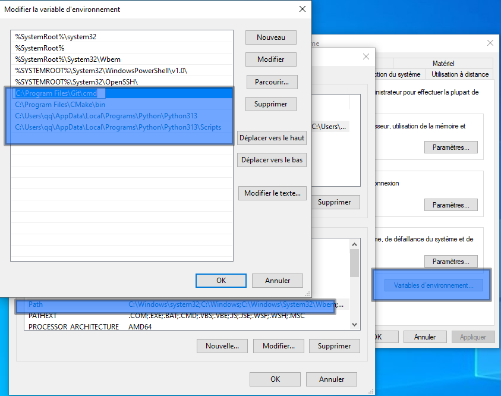
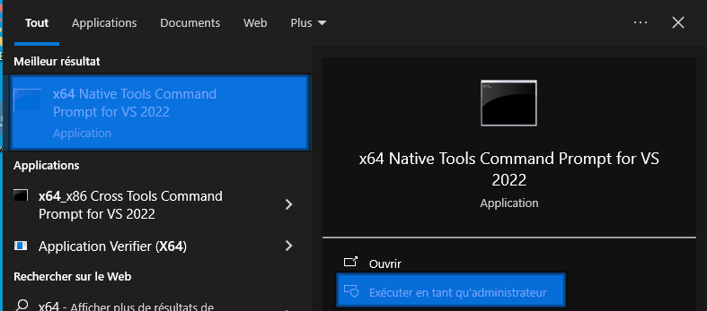

# Compiling and Installing gdCEF

This repository contains the source code of some C++ classes wrapping a subset
of the [Chromium Embedded Framework](https://bitbucket.org/chromiumembedded/cef/wiki/Home)
API into a Godot 4.3 GDExtension which allows you to implement a web
browser for your 2D and 3D games through your gdscripts for Linux, Windows
and MacOS. We have named this CEF GDExtension `gdcef`.

This document supposes you want to compile gdCEF module for Godot 4.2+ for Linux, Windows and MacOS. Otherwise, you can find prebuilt artifacts at https://github.com/Lecrapouille/gdcef/releases.

## Prerequisites for compiling the GDExtension

### Operating System

*IMPORTANT:* Currently this module only works on Linux, Windows and MacOS. Devices such as Android and iOS are not supported by CEF.

### Install System Packages

Install the following tools: `scons, g++, ninja, cmake, git, python3` (version 3.21.0 or higher). We are using C++20, but we are not using fancy C++ features - we just need this version for using `std::filesystem`. We are also using OpenMP by default to parallelize some CPU tasks. It is by default enabled for Linux and Windows. For MacOS, you need to install [openmp](https://www.youtube.com/playlist?list=PLLX-Q6B8xqZ8n8bwjGdzBJ25X2utwnoEG).You can disable it in the `build.py` script.

- For Linux, depending on your distribution you can use `sudo apt-get install`.
- For macOS X you can install [homebrew](https://brew.sh/).
- For Windows users you will have to install:
  - Visual Studio: https://visualstudio.microsoft.com/en/vs/ (mandatory). Do not forget to install Windows SDK (i.e. 10.0.20348.0) in Visual Studio.
  - Python3: https://www.python.org/downloads/windows/
  - CMake: https://cmake.org/download/
  - Ninja: https://ninja-build.org/
  - Scons: https://scons.org/pages/download.html. **Note that Scons is no longer given as standalone executable**, it will be installed inside the `Scripts` folder of the Python installation, through the `pip` command: `python3 -m pip install scons`.
  - Git: https://git-scm.com/download/win
  - *Note:* I have installed them for their official website, I did not tried to install them from the `winget` command.

Please check your PATH variables for Python3, CMake, Ninja, Scons and Git are set correctly. Here is an example for Windows. Scons is installed inside the `Scripts` folder of the Python installation.



To compile GDCef for Windows:
- Make sure VS2022 is installed.
- Open an **x64 Native Tools Command Prompt for VS 2022** with **Administrator** privileges (this should be available in the start menu under Visual Studio 2022). This ensures the environment is properly set up to use the VS tools (for example we use aliases which are disabled in the standard command prompt).



### Install Python3 packages

Our [build.py](../build.py) script is written in **Python3** to be compatible with all operating systems (Linux, macOS X, Windows). Please do not use Python 2. Install the required Python packages with pip by typing the following command in a terminal:

```
python3 -m pip install -r requirements.txt
```

You can also use the virtual environment `venv` to install the required packages.

## Compilation for Linux, Windows and MacOS

**Note for Linux users using old GDCEF version (< 0.10.0)**

For GDCEF versions prior to 0.10.0, after compilation, the system cannot find the shared libraries `libcef.so` (CEF), `libgdcef.so` (Godot native) and other libraries (`libvulkan.so` ...) as artifacts, even when specified in the .gdnlib file. As a temporary solution, you need to add the build path to your `LD_LIBRARY_PATH` (for example in your `~/.bashrc` file):

```
export LD_LIBRARY_PATH=$LD_LIBRARY_PATH:/your/path/gdcef/examples/build
```

For GDCEF version >= 0.10.0, this issue has been fixed. You no longer need to set LD_LIBRARY_PATH. If you were using an older version, don't forget to remove gdcef from your LD_LIBRARY_PATH!

### Compilation of the GDExtension for Godot 3

This module is not compatible with Godot 3. If you need Godot 3 support, please use the
[dev-godot-3 branch](https://github.com/Lecrapouille/gdcef/blob/master/addons/gdcef/build.py)
instead.

### Compilation of the GDExtension for Godot < 4.2

This module is not compatible with Godot 4.0 and 4.1. Please use Godot 4.2 or higher.

### Compilation of the GDExtension for Godot >= 4.2

The [build.py](../build.py) script does not require command-line arguments. It automatically handles all aspects of the build process (detecting your operating system, CPU cores, etc.). By default, it uses predefined versions for Godot and CEF, builds in release mode, and enables OpenMP for parallel processing. You can customize these settings by modifying the variables at the beginning of the script.

```
cd addons/gdcef
./build.py
```

Alternative methods:
```
cd addons/gdcef
python3 build.py
```

Please be patient! The script performs several time-consuming tasks:
- Downloads CEF (~600 MB) from https://cef-builds.spotifycdn.com/index.html, extracts it to `../thirdparty/cef_binary`, compiles it.
- Clones and compiles [godot-cpp](https://github.com/godotengine/godot-cpp) into `../thirdparty/godot-4.2`
- Compiles the [primary CEF process](../gdcef/).
- Compiles the [secondary CEF process](../subprocess/).
- Extracts CEF artifacts (*.so, *.pak, etc.) into the `cef_artifacts` folder (~1GB of data).

## Change the CEF version

If desired, you can change the CEF version at any moment (even after having
compiled CEF).

- Check this website https://cef-builds.spotifycdn.com/index.html and select
  your desired operating system.
- Copy the desired CEF version **without the name of the operating system** (for
  example `120.2.4+gc129304+chromium-120.0.6099.199`) and search in
  [build.py](../build.py) script the line `CEF_VERSION=` and paste the
  new version.
- **Be sure your CEF version contains `+` symbols but not the URL-encode `%2B` format.**
- Rerun the `build.py` the older `thirdparty/cef_binary` folder will be replaced
  automatically by the new version.
- Add back the build folder in your project.

## Change the Godot version

If you want to change the Godot version (4.2 or 4.3), you can do it by modifying the `GODOT_VERSION` variable in the [build.py](../build.py) script. Do not use version 4.1 since gdextension is not compatible.

## What to do if I dislike the folder name `cef_artifacts` holding CEF artifacts ?

You can change the default folder name! Look for the line `CEF_ARTIFACTS_FOLDER = "cef_artifacts"` in the [build.py](../build.py) script and modify it. Then rerun `build.py`. This method will set the default path for Godot. Alternatively, you can specify the path in your GDScript code (see the API documentation for more details):

```
$CEF.initialize({"artifacts": "res://cef_artifacts/", ... })
```

## I do not want to compile GDCEF!

If you prefer not to compile GDCEF, there is an option in the [build.py](../build.py) script. Modify this line:

```
GITHUB_GDCEF_RELEASE = None
```

Visit https://github.com/Lecrapouille/gdcef/releases to find your desired version (omit the 'v' prefix and Godot version). For example:

```
GITHUB_GDCEF_RELEASE = "0.12.0"
```

Limitations:
- You cannot choose the Godot version
- You cannot choose the CEF version