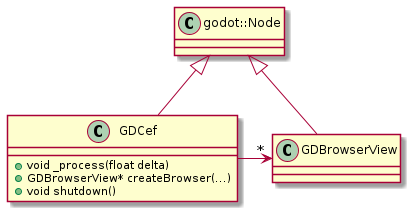

# Stigmee details design

This details design document concerns the repository
https://github.com/stigmee/gdnative-cef implementing a [Chromium Embedded
Framework](https://bitbucket.org/chromiumembedded/cef/wiki/Home) (CEF) native
module for the [Godot editor](https://godotengine.org/) (gdCef).

Inside the `gdcef` folder, two main classes deriving from `godot::Node` have
been created wrapping the CEF C++ API to be usable from Godot scripts. Deriving
from Node allows to instances of these classes to be attached inside to
scene graph like depicted by the following picture.

See this
[document](https://docs.godotengine.org/en/stable/classes/class_node.html)
concerning what a Godot Node is. For Stigmee, the Godot C++ wrapper is localized
in the folder `$WORKSPACE_STIGMEE/godot/3.4.3-stable/cpp`.

## Classes Diagram

The following picture depicts the class diagram:

- `GDCef` implemented in [gdcef/src/gdcef.cpp](gdcef.[ch]pp). Its goal is to
  wrap the initialization phase of CEF, its settings and the loop back of
  messages of CEF sub processes. This class allows to create `GDBrowserView`
  that are attached as child nodes inside the scene graph.

- `GDBrowserView` implemented in [gdcef/src/gdbrowser.cpp](gdbrowser.[ch]pp).
  Its goal is to wrap a browser view allowing to display the web document, to
  interact with the user (mouse, keyboard), to load pages, ...

The [gdcef/src/gdlibrary.cpp](gdcef/src/gdlibrary.cpp) allows to Godot to
register the two classes. See this document for more information:
https://docs.godotengine.org/en/stable/development/cpp/custom_modules_in_cpp.html

## CEF Secondary process

A [secondary CEF
process](https://bitbucket.org/chromiumembedded/cef/wiki/GeneralUsage.md#markdown-header-separate-sub-process-executable)
is needed when the CEF (here, our class `GDCef`) cannot directly access to the
`main(int argc, char* argv[])` function of the application. This mandatory for
its initialization. This is unfortunatly the case since a CEF is created as node
scene graph from but CEF does not come natively inside the Godot engine and
accessing to the Godot engine `main` function.

When starting, CEF will fork several times the application it runs in and the
forked processes become specialized processes

You have to know that CEF modifies the content of your `argv` and this may mess
up your application if it also parses the command line (you can back it up,
meaning using a `std::vector` to back up `argv` and after CEF init to restore
values in `argv` back). What is "two separated process" exactly ? Just an extra
fork: the main process forks itself and call the secondary process, which can
fully access to its own main(int argc, char* argv[]). The main constrain is the
path of the secondary process shall be canonic (and this is a pain to get the
real path).

## Diagram Sequence
