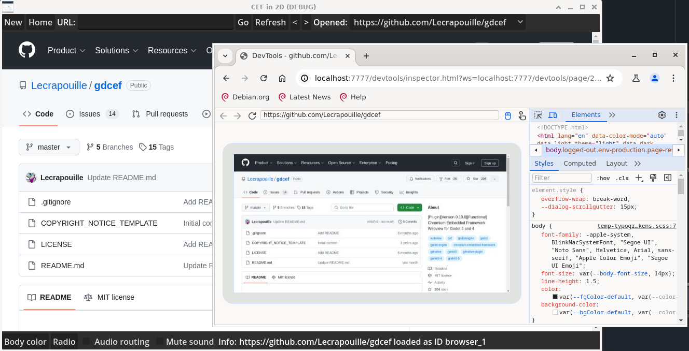
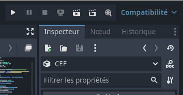
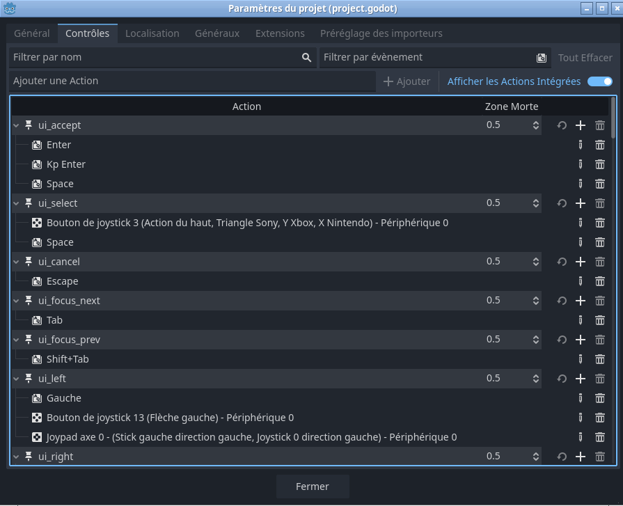

# Frequently Asked Questions

## Compilation

### Why do I need to compile prebuilt CEF whereas .dll and other files are already provided?

Because we need to link against `libcef_dll_wrapper` that is only obtained by compiling CEF sources.

## Debugging

### How to debug gdCEF?

In your GDScript, when initializing CEF, pass the following settings:

```gdscript
$CEF.initialize({"remote_debugging_port": 7777, "remote_allow_origin": "*", ... })
```

Open a Chrome browser and type in the URL: `chrome://inspect`. A document appears. Click on the `Configure` button of `Discover network targets`. Set `localhost:7777` as the port. You will see something like this:



## Performance

### Why is my CPU usage at 70% when running gdCEF?

Try switching Godot's graphics mode to 'Compatibility' instead of 'Forward+'. See below, on the top right corner:



## Platform Support

### What architectures are supported?

- CEF is currently not supported on iOS or Android devices. For Android, you can see this [project](https://github.com/Sam2much96/GodotChrome).
- Chrome extensions are limited to version 2, although most users now rely on version 3.

## Input Handling

### I have conflicts with my keyboard bindings

Yes, Godot has default keyboard bindings which can interfere with CEF. For example, if you have a Godot button and if you press the `KEY_SPACE` the button callback is called. If you want to use the CEF clipboard (copy, paste, cut), you have to disable the default Godot keyboard bindings, else an infinite loop occurs.

See your Godot project settings to disable the default keyboard bindings.



## Known Limitations

### What are the current limitations?

- Keyboard limitation: https://github.com/Lecrapouille/gdCEF/issues/55
- Slow and with limitations: https://github.com/Lecrapouille/gdCEF/issues/50
- Restricted for some access: https://github.com/Lecrapouille/gdCEF/issues/75
- Native popup widgets (i.e. an expanded `<select>` list) are not rendered:
  CEF paints them in a separate buffer that gdCEF does not composite over the
  page texture.

### I cannot watch videos!

CEF does not include by default H264 or ffmpeg codecs for licensing reasons. You can add them by compiling CEF by yourself with the correct options, instead of using the prebuilt binaries. Unfortunately, gdCEF currently follows the restrictions imposed by CEF.

### How to block ads?

For the moment we cannot block ads.

## Technical Details

### Why do your classes use subclass Impl?

Godot uses a reference counter that conflicts with CEF's reference counter. To avoid compilation issues, we have to trick by creating an intermediate class.

## Licensing

### Important notes on the CEF license

**IMPORTANT:** I'm not a legal expert, but be aware that CEF uses some third-party libraries under the LGPL license (see this [post](https://www.magpcss.org/ceforum/viewtopic.php?f=6&t=11182)). Compiling CEF as a static library may subject **your** project to the GPL license, requiring you to share your application's source code. This does not apply when compiling CEF as a dynamic library.

In our case, CEF is compiled as a static library for Windows (due to various issues, see our [patch](../gdcef/patches/CEF/win/)), and as a shared library (`libcef.so` > 1 GB, which is quite large) for Linux. Unfortunately, I was unable to compile it as a static library on Linux to reduce its size.

### Note concerning gdCEF license

This repository is a fork of [this repo](https://github.com/stigmee/gdnative-cef), originally under GPLv3, but with a more permissive license: MIT. Since the original repo is no longer maintained by its two original authors (Alain and Quentin), we, the undersigned Alain and Quentin, have given consent to relicense the original code under the MIT license.
