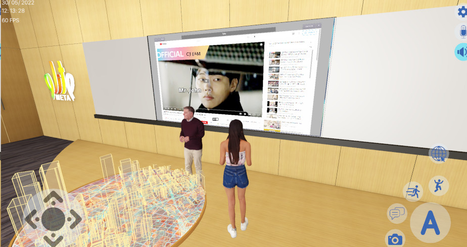
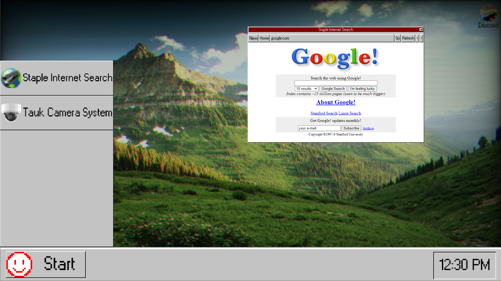

# Projects Using gdCEF

Thanks to the teams who have contributed to the current gallery.

---

## Submit Your Project

Want to showcase your project here? Submit a pull request with:

1. A screenshot or video of your project (add it to the `doc/gallery/` folder)
2. A brief description
3. Links to your project (repository, website, etc.)

---

## Wattesigma

**By:** [FaceDev](https://github.com/face-hh)

A full-featured web browser built entirely with Godot Engine.

*Click the picture to watch the YouTube video "I made my own Browser" by FaceDev.*

**Links:**

- [GitHub Repository](https://github.com/face-hh/wattesigma)
- [YouTube Video](https://youtu.be/37ISfJ2NSXQ)

---

## Elitemeta

**Status:** Discontinued

A metaverse project that integrated web browsing capabilities.

*Click the picture to watch the Elitemeta video shared on IPFS (you need an IPFS client to watch it).*

**Links:**

- [Website](https://elitemeta.city)

---

## TNITRFR

A project featuring a 90's computer browser aesthetic.

**Links:**

- [GameJolt Page](https://gamejolt.com/games/TNITRFR/948968)

