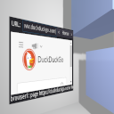

# Godot/CEF Demos

## Demo 00: Multiple CEF browsers

A demo showing a GUI with multiple CEF browser tabs. No mouse and keyboard
events are managed. A timer is loading URLs one by one.

## Demo 01: CEF in 3D

A demo showing a GUI instanced within a CEF, a 3D scene using viewports,
as well as forwarding mouse and keyboard input to the GUI.

This demo is based on the asset library: https://godotengine.org/asset-library/asset/127

